# Design Research: Interactive Map-to-Card Exploration Flow

*Olympic + Paralympic Discovery Platform — Team USA*
*Research date: 2026-05-03*

---

## TL;DR

The clearest adjacent pattern is the **clickable US state map → region-specific content card** flow used by onx-offroad and FOLX Health, combined with the **digital sports collectible program** model pioneered by MLS Quest. The critical implementation insight: treat the map as an *emotional* entry point (it's a giant unlock screen, not a data table), and the card flip as the *reward* moment. The holographic shine effect is table stakes for the trading-card feel — simeydotme's Pokemon Cards CSS is the engineering reference to fork.

---

## Recommendations / Next Steps

### 1. Design the map as an "unlock screen," not a data visualization
State hover = a rising card preview with athlete thumbnail + medal count. Don't show a tooltip — show the card itself starting to materialize. Clicked states visually "open" via a scale + glow pulse.

```
┌─────────────────────────────────────────────────────┐
│  TEAM USA  ○ MAP VIEW  ○ COLLECTION VIEW            │
├─────────────────────────────────────────────────────┤
│                                                     │
│     ┌──────────────────────────────────┐            │
│     │           [US SVG MAP]           │            │
│     │    hover state → glow accent     │            │
│     │    clicked → scale up + pulse    │            │
│     │                                  │            │
│     │   CA*  TX   FL  NY   OH  ...     │            │
│     │  (gold highlight = collected)    │            │
│     └──────────────────────────────────┘            │
│                                                     │
│  [12 / 50 states explored] ████░░░░░░  24%          │
└─────────────────────────────────────────────────────┘
```

### 2. Make the card flip the central interaction — front sells, back informs
Front: full-bleed athlete photo, state name, medal type indicator. Back: stats grid, Olympic vs Paralympic split (equal visual weight), CTA to mini-game or "Explore State."

```
FRONT                          BACK
┌──────────────┐               ┌──────────────┐
│ ░░░░░░░░░░░░ │               │  CALIFORNIA  │
│ ░ATHLETE░░░░ │  ──flip──>    │  ───────────│
│ ░PHOTO░░░░░░ │               │  🏅 Olympic  │
│              │               │  Athletes: 47│
│  CALIFORNIA  │               │  🏅 Para     │
│  ─────────── │               │  Athletes: 31│
│  ⭐ GOLD  ×3 │               │  Gold  Silv  │
└──────────────┘               │  ─────────── │
                               │  [PLAY GAME →]│
                               └──────────────┘
```

### 3. Implement the holographic shine as a core part of card identity
Use `mousemove` to track cursor position → drive a CSS custom property `--mx` / `--my` → apply as a radial gradient overlay + `hue-rotate` filter. The Pokemon Cards CSS (simeydotme) GitHub repo is a direct fork-ready reference for this.

```css
/* Core technique */
.card:hover::after {
  background: radial-gradient(
    circle at var(--mx) var(--my),
    hsla(var(--hue), 100%, 80%, 0.4),
    transparent 60%
  );
  mix-blend-mode: color-dodge;
}
```

### 4. Keep the map ↔ collection toggle in the primary nav, not buried
The switch between map view and card grid should be persistent and prominent — top center, like a segmented control. Don't make users hunt for it.

```
  ┌──────────────────────────────────────────────┐
  │  [🗺 EXPLORE MAP]    [🃏 MY COLLECTION]       │
  │   (active: underline + accent color)          │
  └──────────────────────────────────────────────┘
```

### 5. Encode Olympic + Paralympic parity visually, not just in copy
Give Paralympic stats the same card real estate as Olympic stats — two equal columns on the card back, same font size, same visual weight. Don't use footnote-style treatment for Paralympic data.

```
CARD BACK — EQUAL WEIGHT LAYOUT
┌──────────────────────────────┐
│   🟡 OLYMPIC    ♿ PARALYMPIC  │
│   ─────────────────────────  │
│   Athletes  47    Athletes 31 │
│   Medals    12    Medals    8 │
│   Gold       3    Gold      2 │
└──────────────────────────────┘
```

---

## Key Examples

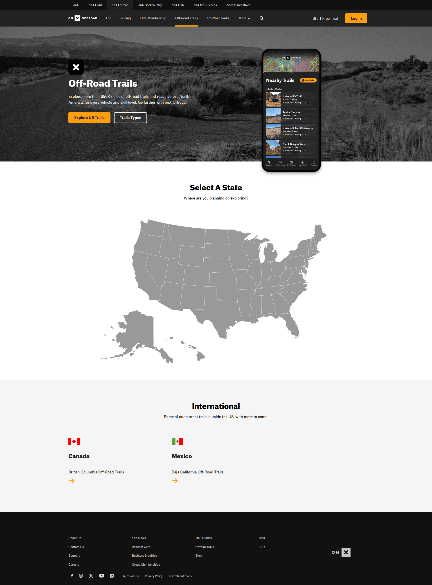
*onX Offroad — Interactive US map where users select a state to discover region-specific content (trails); users can also "Browse All" as fallback. Closest structural analog to the Team USA state exploration flow. [Lazyweb]*

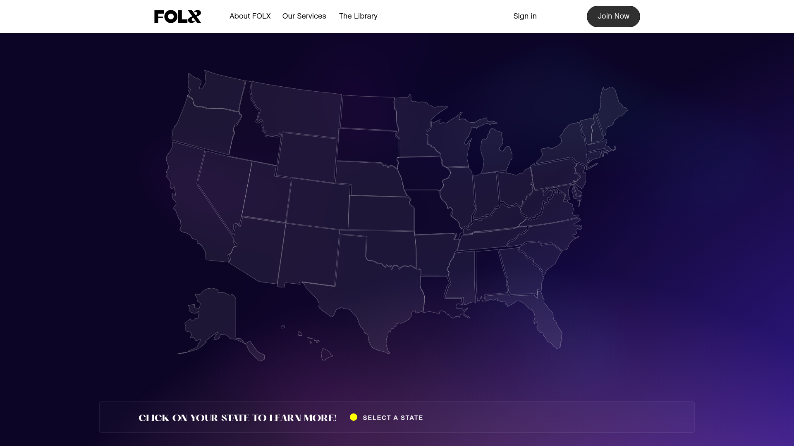
*FOLX Health — US map outline in purple, users click a state to reveal location-specific services and stats. Demonstrates that the "click state → get data" pattern works outside navigation/geo apps, and that minimal ornamentation on the map canvas lets the states themselves carry meaning. [Lazyweb]*

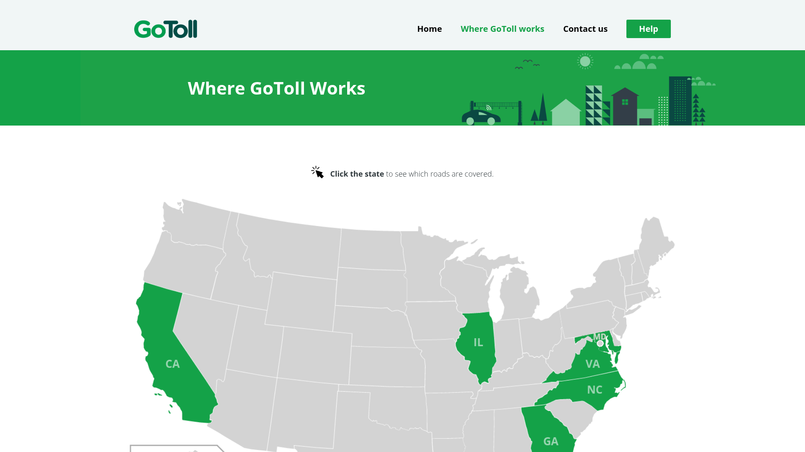
*GoToll — Coverage map with highlighted US states, clicking a state reveals details. Shows the visual "unlocked vs locked" state pattern using green fill — directly applicable to "states you've collected" vs "states still to explore." [Lazyweb]*

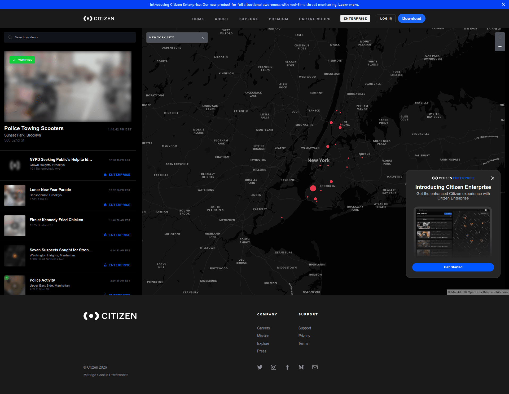
*Citizen — Full-screen interactive map with a persistent left sidebar showing a feed of cards (incident reports). The map and card list are co-present, not toggled. Useful reference for a split-view home layout if you want map + cards simultaneously. [Lazyweb]*

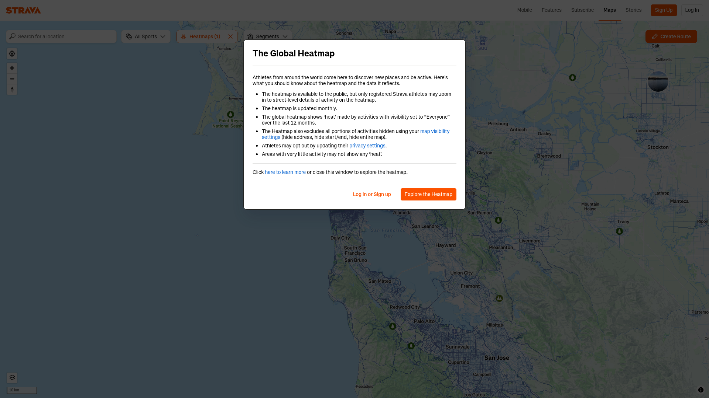
*Strava — Global Heatmap with a centered modal that explains the data and provides a primary CTA ("Explore the Heatmap"). Shows how a map-entry-point with an explanation overlay can work without being patronizing. [Lazyweb]*

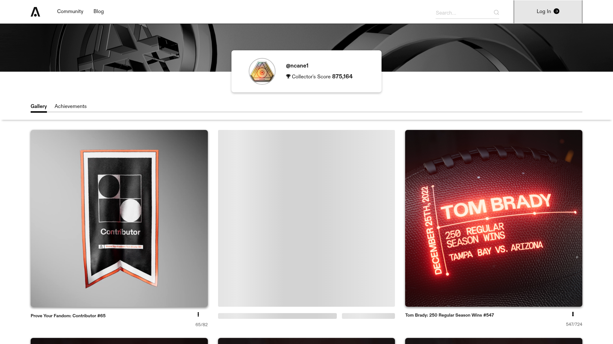
*Autograph (Tom Brady's platform) — User's collected drops shown as a three-card grid, with neon-styled celebrity cards (Tom Brady edition), geometric badge cards, and empty placeholder slots. This is the direct competitor pattern for the collection view — note how empty slots create urgency to complete the set. [Lazyweb]*

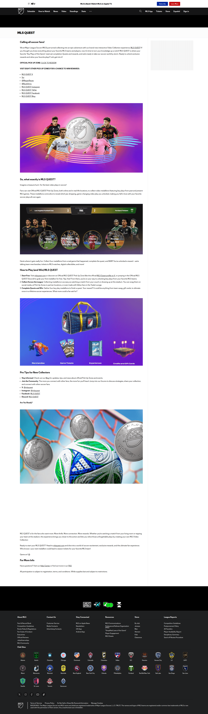
*MLS Quest — Digital collectibles program page explaining how to collect match icons, complete challenges, and earn rewards (tickets, merch, credits). The most direct competitor model to Common Ground's mission: sports → collectibles → gamification loop. Key learning: they explicitly downplayed the "blockchain/NFT" framing to not alienate casual fans. [Lazyweb]*

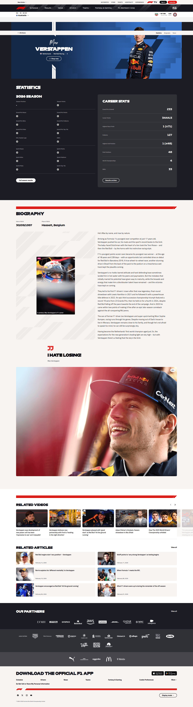
*Formula 1 — Driver profile page with large athlete hero, team context, season stats summary, and career totals. This is effectively what the card back should aspire to when expanded — it's the same information architecture: athlete identity → current season → career history → CTA. [Lazyweb]*

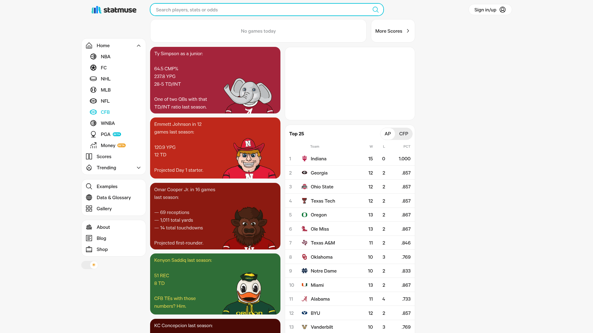
*StatMuse — Sports stats dashboard where teams are presented as colorful avatar cards in a browseable grid, alongside a search bar and leaderboard. Strong reference for the card grid view — shows how team/athlete identity cards with color branding can be both data-dense and visually engaging. [Lazyweb]*

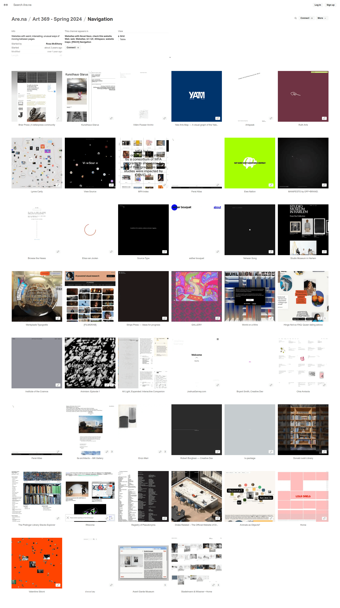
*Are.na — Channel page with a grid/table view toggle in the header. Simple, well-placed, and doesn't interrupt the primary content. Shows where to place the map ↔ collection toggle without it feeling like a secondary feature. [Lazyweb]*

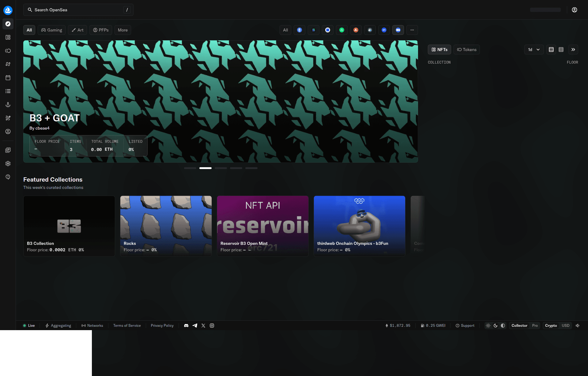
*OpenSea — NFT marketplace collection page with prominent grid/list toggle, hero banner, and filter controls. Most complete reference for a collection-browsing interface that handles large inventories elegantly. [Lazyweb]*

---

## Patterns

Based on all references, strong examples in this design space share:

1. **The map as emotional entry point, not a nav utility.** onx-offroad, FOLX Health, GoToll — all use the map to make the user feel like an explorer. The visual language is "choose your adventure," not "filter by region."

2. **Empty state slots as progress motivators.** Autograph's placeholder cards create an obvious "complete the set" impulse. This is one of the most powerful pattern in any collectible UX — the gap is the hook.

3. **Equal-weight bilateral layout for two data types.** When there are two categories of equal importance (Olympic + Paralympic), strong designs give them mirror-image visual treatment. Don't rank them — present them symmetrically.

4. **The toggle lives in the top bar.** Are.na, OpenSea — the grid/list/map toggle is always in the persistent header, never hidden in a dropdown. Users who want the other view shouldn't have to search for it.

5. **The card flip is a *reveal*, not a navigation event.** The best flip interactions feel like unwrapping — the front is the hook (athlete, visual, state), the back is the payoff (stats, history, action). Don't put the same content on both sides.

6. **On hover, the card responds to the cursor.** Tilt + shine tracks the mouse in real time. This is what distinguishes a "card" from a "tile" — the physical metaphor of picking up a card.

7. **Friction-free collection.** MLS Quest deliberately avoided Web3 jargon and wallet requirements. For Common Ground, this means: no account required to explore, account required only to *save* progress. Lower the barrier to first engagement.

---

## Anti-Patterns

- **Showing all 50 states as equal visual weight at once.** Without a discovered/undiscovered distinction, the map just looks like a geography lesson. Apply the "lit vs unlit" treatment from the start.

- **Making the card flip the only way to see stats.** Some users won't figure out the flip. Always provide a fallback: hovering over the card can show a small stats preview, and the expanded (flipped) modal should also be accessible via a button.

- **Treating Paralympic data as supplementary.** Putting it in a small tab or footnote sends the wrong signal. Equal prominence is a design decision that needs to be enforced in the component, not just in copy guidelines.

- **Map tooltips instead of card previews.** The pattern of showing a text tooltip on state hover (common in election map / data viz UIs) feels cold for a discovery platform. Show the card itself rising from the state.

- **The grid/list toggle as a settings-panel item.** Buried toggles break discoverability. If users can't see both views within 3 seconds of landing, the toggle might as well not exist.

- **Holographic effect that plays on page load without hover.** The shimmer/tilt effect loses its magic if it's always animating. It should be triggered by mouse interaction only — the moment of hover should feel like the card "waking up."

---

## Unique Angles

**MLS Quest's "Key Play Medallion" mechanic** — instead of static card art, each card in MLS Quest plays a video clip when opened. For Common Ground, the analog would be: each state card, when flipped, could play a 5-second highlight reel of the athlete's most iconic moment. This transforms the card from data display into *emotional memory*.

**GoToll's "supported/unsupported" map state** — they use green fill for "covered" states and gray for others. For Common Ground, the team could use this to show *medal density* per state as a choropleth fill (darker = more medals), giving the map itself a data story before a user clicks anything.

**Strava's heatmap as ambient data** — the heatmap shows aggregate activity without requiring a single click. Common Ground could display a "medal heatmap" across states as the default map view, making the data visible from first load, with click/hover drilling into the specific card.

**simeydotme's Pokemon Cards CSS approach** — the only open-source project that fully recreates the physical holographic trading card experience in CSS (foil, shine, 3D tilt, sparkle). It's designed for Pokemon, but the technique is fully transferable. This is the implementation shortcut for the entire holographic card visual.

---

## Findings

**The map-to-card pattern exists in fragments, not in totality.** There's no single product that combines (a) clickable US state map + (b) collectible card flip + (c) holographic microinteraction + (d) collection view. The closest single product is MLS Quest for the *concept*, and onx-offroad for the *map UX*, but neither does both.

**The collectible card format is having a moment in sports digital products.** MLS Quest (2024), Autograph (Tom Brady's platform), NBA Top Shot — the market is validating that sports fans will engage with collectible digital cards. Common Ground benefits from this cultural moment for LA28.

**Paralympic parity is a genuine design gap.** No product in the Lazyweb corpus handles "two equally important data types within a single card" well. F1 shows how to present athlete stats, but it doesn't have a dual-track structure. This is both a challenge and an opportunity — design the parity well and it becomes a differentiator.

**The holographic shine effect is technically straightforward but requires CSS discipline.** The Pokemon Cards CSS project (simeydotme on GitHub) is the single best reference implementation. It uses `mousemove` events to feed `--mx`/`--my` CSS custom properties into a `radial-gradient` overlay with `mix-blend-mode: color-dodge`. The React port by Jerin John K. (via Skia) shows it works in component-based architectures.

**Map data at the state level is semantically appropriate for Olympic athletes.** USOPC and LA28 track athletes by state of training/origin, and the Snowflake/LA28 partnership (announced May 2025) indicates rich data will be available for LA28. Building the map interaction now, with placeholder data, positions the product well for the Games in 2028.

---

## Sources

- [onX Offroad — Trail Discovery (US Map)](https://www.onxmaps.com/offroad/trails)
- [FOLX Health — Service Map](https://www.folxhealth.com/service-map)
- [MLS Quest — Digital Collectibles Program](https://www.mlssoccer.com/mlsquest/)
- [MLS Quest announcement on Sweet/Sui blockchain](https://medium.com/sweetnft/announcing-mls-quest-an-all-new-way-to-experience-major-league-soccer-f52d1ffc4f96)
- [simeydotme Pokemon Cards CSS — Holographic Effect Reference](https://github.com/simeydotme/pokemon-cards-css)
- [CSS-Tricks — Holographic Trading Card Effect](https://css-tricks.com/holographic-trading-card-effect/)
- [5 Map UI Design Patterns That Elevate UX — Bricxlabs](https://bricxlabs.com/blogs/map-ui-design-patterns-examples)
- [Snowflake + LA28 Olympic/Paralympic Data Partnership](https://www.usopc.org/news/2025/may/27/snowflake-partners-with-the-la28-olympic-and-paralympic-games-and-team-usa-to-deliver-the-data-sharing-and-collaboration-platform-for-the-most-data-driven-games-of-all-time)
- [Hexagon — Mapping Olympic and Paralympic Glory](https://sigblog.hexagon.com/mapping-olympic-and-paralympic-glory-visualizing-winning-countries-with-m-app-enterprise/)
- [uicookies — 35 Best CSS Card Flip Animations](https://uicookies.com/css-card-flip/)
- [Autograph — Tom Brady Collectibles Platform](https://autograph.io)
- [F1 — Max Verstappen Driver Profile](https://www.formula1.com/en/drivers/max-verstappen)
- [StatMuse — Sports Stats Dashboard](https://www.statmuse.com/cfb)
