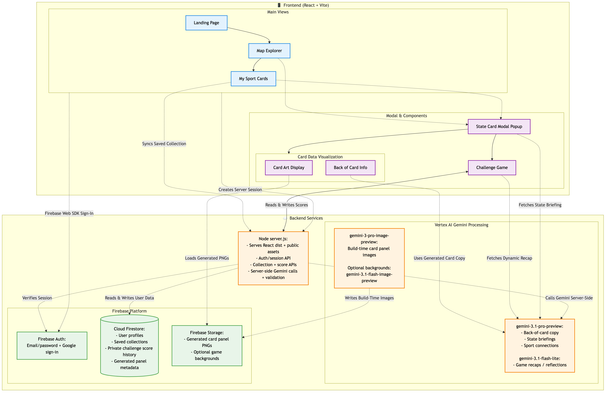

<p align="center">
  
</p>

<h1 align="center">Common Ground</h1>

<p align="center">
  Geography-powered Team USA fan discovery map for aggregate Olympic and Paralympic state signals.
</p>

Common Ground is a geography-powered fan discovery app for Challenge 2: The Hometown Success Engine. It lets fans select a U.S. state, inspect one unified Olympic and Paralympic state insight card, read a Gemini-generated briefing, and try a short fan challenge tied to the card's shared trait.

This repository is licensed under [Apache License 2.0](LICENSE).

## Run Locally

Install dependencies:

```bash
npm install
```

Start the API server for Gemini/fallback routes:

```bash
npm run api
```

In another terminal, start the React app:

```bash
npm run dev
```

Open `http://127.0.0.1:5173`.

The Vite dev server proxies `/api` calls to `http://127.0.0.1:3000`. If the API server is not running, the browser app still uses safe local fallback copy for testing.

## Environment Variables

Create one `.env` file at the repo root. `server.js`, the generation scripts, and `scripts/deploy-cloud-run.sh` all read this same file. Vite only exposes variables prefixed with `VITE_` to the browser build. `.env` is ignored by git and Docker, so keep real values there instead of in the README.

```dotenv
# Google Cloud / Vertex AI Gemini
GOOGLE_CLOUD_PROJECT=[PROJECT-ID]
GOOGLE_CLOUD_LOCATION=global
GEMINI_MODEL=gemini-3.1-pro-preview
GAME_REFLECTION_MODEL=gemini-3.1-flash-lite

# Firebase browser auth
VITE_FIREBASE_API_KEY=[WEB-API-KEY]
VITE_FIREBASE_AUTH_DOMAIN=[FIREBASE-PROJECT-ID].firebaseapp.com
VITE_FIREBASE_PROJECT_ID=[FIREBASE-PROJECT-ID]
VITE_FIREBASE_APP_ID=[WEB-APP-ID]

# Firebase Admin / generated panel storage
FIREBASE_STORAGE_BUCKET=[FIREBASE-PROJECT-ID].firebasestorage.app
GOOGLE_APPLICATION_CREDENTIALS=/absolute/path/to/local-service-account.json

# Optional when it differs from VITE_FIREBASE_PROJECT_ID or the credentials JSON project
# FIREBASE_PROJECT_ID=[FIREBASE-PROJECT-ID]

# Cloud Run deploy script
CLOUD_RUN_SERVICE=common-ground
CLOUD_RUN_MIN_INSTANCES=1

# Optional Firebase web config fields
# VITE_FIREBASE_STORAGE_BUCKET=[FIREBASE-PROJECT-ID].firebasestorage.app
# VITE_FIREBASE_MESSAGING_SENDER_ID=[SENDER-ID]

# Optional tuning / auth overrides
# FIREBASE_SESSION_DAYS=5
# VERTEX_AUTH_MODE=auto
# VERTEX_ACCESS_TOKEN=[ACCESS-TOKEN]
# GEMINI_API_KEY=[API-KEY]
# GOOGLE_API_KEY=[API-KEY]
# CARD_IMAGE_REQUEST_TIMEOUT_MS=900000
# CARD_IMAGE_MAX_ATTEMPTS=3
# CARD_IMAGE_RETRY_DELAY_MS=5000
# CARD_COPY_MODEL=gemini-3.1-pro-preview
```

For local Vertex AI calls, run `gcloud auth login` or set `VERTEX_ACCESS_TOKEN`. For Cloud Run, do not ship a service-account JSON file; the deployed service uses its attached service account instead.

API-key fallback is still supported for local Gemini testing. Use it instead of Vertex mode by leaving `GOOGLE_CLOUD_PROJECT` unset and setting `GEMINI_API_KEY` or `GOOGLE_API_KEY` in `.env`.

Gemini-backed routes:

- `POST /api/gemini/state-briefing`
- `POST /api/gemini/game-reflection`

If no key is present, the server returns compliance-safe fallback copy.

## What Is Implemented

- React/Vite app with home, map, collection, challenge, login, and settings routes.
- Actual U.S. state boundary map from `us-atlas` TopoJSON rendered with D3 and `topojson-client`.
- 50 U.S. state insight cards generated from public TeamUSA.com Olympic Games Paris 2024, Paralympic Games Paris 2024, Olympic Winter Games Milano Cortina 2026, and Paralympic Winter Games Milano Cortina 2026 roster sources.
- Data-scope controls for Paris 2024, Milano Cortina 2026, or both datasets together.
- Hover tooltip showing Olympic, Paralympic, and total public hometown geography athlete counts before clicking.
- Map controls for wheel/trackpad zoom, drag panning, reset, and browser-local state matching.
- Unified state insight card with generated Olympic and Paralympic panel art when available, abstract bitmap fallback art, aggregate sourced data, sport lists, top city-level hometown areas, and a Sources & Method panel.
- No account required to explore the map and open cards; login is required to view and sync the My State Insight Cards collection across sessions.
- Gemini state briefing and game reflection endpoints with local validation and fallback copy.
- Focus Window, Rhythm Shift, Precision Trace, Open Space, and Pattern Scout fan challenges.
- Private signed-in score history for fan challenges; guests can still play and see an unsaved local result.
- Settings page for dark mode, reduced motion, larger text, high contrast, visible focus rings, and signed-in progress reset.
- Cloud Run-ready server and Dockerfile.

## Architecture

The app uses a React/Vite frontend, a Node production server, Vertex AI Gemini for server-side generation and briefings, and Firebase for auth, saved collections, private score history, generated panel metadata, and generated panel image storage.

<p align="center">
  
</p>

The diagram source lives at `assets/architecture.mmd`; the rendered README image lives at `assets/architecture.png`.

## Real Data Notes

The dataset is generated by:

```bash
npm run ingest:teamusa
```

Generated frontend data lives at `public/data/state-cards.json`.

The ingest pipeline:

- Uses public TeamUSA.com Olympic Games Paris 2024, Paralympic Games Paris 2024, Olympic Winter Games Milano Cortina 2026, and Paralympic Winter Games Milano Cortina 2026 roster sources.
- Filters to records with U.S. hometown geography abbreviations
- Deduplicates athletes across imported rosters in memory before writing aggregate counts.
- Aggregates by geography and sport family.
- Aggregates top city-level hometown areas as public athlete counts.
- Strips athlete names, images, profile URLs, biographies, medals, rankings, finish times, and individual-level fields.
- Converts exact state counts into low, medium, high, or insufficient-data buckets for the main card panels.

"Official counts" in this prototype means deduplicated public TeamUSA.com athletes from the imported rosters with supported U.S. hometown geography fields. It is not a complete historical Team USA athlete census.

Dataset source references, retrieval dates, excluded-row counts, and aggregation policies are embedded in `public/data/state-cards.json` under `meta`.

## Generated Card Art

Abstract bitmap card art is generated locally:

```bash
npm run generate:card-art
```

Assets are written to `public/assets/card-art`. They are geometric, decorative, and do not contain athlete likeness, official marks, logos, rings, medals, flags, or embedded text.

The state-card front can also use Vertex AI Gemini image panels, with one Olympic panel image and one Paralympic panel image per state. The same generator uses Gemini text generation to write the back-of-card Olympic and Paralympic panel copy from the aggregate top sport tags and geography context.

```bash
npm run generate:card-panels -- --states CO
npm run generate:card-panels -- --states CO,WA --force
npm run generate:card-panels -- --states CA --data-scopes both,paris2024,milanoCortina2026
npm run generate:card-panels -- --all
```

This reads `GOOGLE_CLOUD_PROJECT` and `GOOGLE_CLOUD_LOCATION` from `.env`, defaults to `gemini-3-pro-image-preview` for images and `gemini-3.1-pro-preview` for panel copy, and writes images plus a manifest to `public/assets/card-panels`. If live Vertex images are not present, the UI falls back to the local abstract card art.

Generated panels are scope-aware for `both`, `paris2024`, and `milanoCortina2026`. When two data views use the same generated panel inputs, the generator reuses the existing image and Gemini back-of-card copy instead of making another request. When only the featured sport matches, it can reuse the art while generating scoped back-of-card copy.

The panel generator uses state-aware palette stories, so California, Florida, Texas, Colorado, and other geographies can produce distinct collectible-card color systems instead of always defaulting to blue Olympic panels and orange Paralympic panels. It also prompts for full-bleed artwork, since the React card supplies the actual frame and labels.

For local Firebase generation, `GOOGLE_APPLICATION_CREDENTIALS` is used by Firebase Admin for Firestore and Storage. `FIREBASE_PROJECT_ID` is optional when the JSON key belongs to the Firebase project, but keeping it in `.env` makes split-project setups explicit. Vertex image generation uses `gcloud auth print-access-token` by default when that JSON key belongs to a different project than `GOOGLE_CLOUD_PROJECT`.

Then run one state:

```bash
npm run generate:card-panels:firebase -- --states CA --data-scopes both,paris2024,milanoCortina2026
```

Or all generated records in the data file:

```bash
npm run generate:card-panels:firebase -- --all
```

Use `--force` to replace existing generated panels. Firebase mode uploads each image to Storage, writes Gemini-generated panel copy and panel metadata to `cardPanels/{STATE}` and `cardPanels/{STATE}/panels/{program}` in Firestore, and updates the local manifest with Firebase download URLs.

Set `VERTEX_AUTH_MODE=service_account` only if you intentionally want Vertex to use the JSON key too; in that case the service account needs `roles/aiplatform.user` on the Vertex project. `VERTEX_AUTH_MODE=gcloud` forces local gcloud auth. The default `auto` mode is usually best.

## Firebase Auth

The app supports Firebase Authentication with email/password and Google sign-in. The browser uses the Firebase Web SDK for sign-in and token refresh, then sends the Firebase ID token to the Node server. The server verifies that token with Firebase Admin, creates an HTTP-only `common_ground_session` Firebase session cookie, and uses that session for `/api/user/collection` sync.

Keep browser Firebase values in the `VITE_FIREBASE_*` keys and server/Admin values in the non-`VITE_` keys from the root `.env` example. If `FIREBASE_PROJECT_ID` is omitted, the deploy script uses `VITE_FIREBASE_PROJECT_ID` so the browser ID token audience matches Firebase Admin. `FIREBASE_SESSION_DAYS` is interpreted as days, supports fractional values, and is clamped between Firebase's 5-minute and 2-week session-cookie limits.

## Compliance Notes

The app intentionally avoids:

- Athlete names, images, likenesses, cards, and rankings.
- Finish times and specific scoring results.
- Olympic rings, Paralympic Agitos, torch imagery, Team USA logos, LA28 logos, NGB logos, and third-party brand marks.
- Causal claims that geography produces or guarantees athletic success.
- Mini-game comparisons to athletes, medals, training baselines, or competition results.
- Any separate "switch to Paralympic view" control.

Olympic and Paralympic panels are always shown together in one shared state card.

## Cloud Run

Deploy with the included script:

```bash
npm run deploy:cloud-run
```

The script reads `.env`, builds the app, enables required Google Cloud services, creates or reuses the `common-ground-vertex` service account, grants Vertex, Firestore, Firebase Auth, Storage, and Firebase token-signing permissions, builds the Docker image with Cloud Build, and deploys Cloud Run.

Cloud Run uses its attached service account for Vertex AI, Firestore, and Firebase Storage. Do not upload or set a service-account JSON credentials file in Cloud Run.

`CLOUD_RUN_MIN_INSTANCES=1` keeps at least one Cloud Run instance warm to reduce cold starts. This increases Cloud Run cost compared with scaling to zero. Set it to `0` only when cold starts are acceptable.

## File Map

- `src/main.jsx` - React entry point and provider setup.
- `src/App.jsx` - app routing, state selection, data-scope handling, card modal state, and collection sync.
- `src/components/` - map, card, collection, challenge, shell, navigation, and shared UI components.
- `src/pages/` - landing, login, and settings pages.
- `src/lib/` - dataset shaping, Firebase helpers, score history, and shared constants.
- `src/auth/` - Firebase Auth provider and session lifecycle.
- `src/styles/` - Common Ground visual system.
- `server.js` - Cloud Run static server and Gemini API routes.
- `assets/architecture.mmd` - Mermaid source for the architecture diagram.
- `assets/architecture.png` - rendered architecture diagram used in this README.
- `public/data/state-cards.json` - aggregate geography-level dataset used to build the 50 enabled state cards.
- `public/data/us-states-*.json` - state boundary TopoJSON.
- `public/assets/graphics/favicon.ico` - app favicon and README logo.
- `public/assets/graphics/` - app feature graphics and visual assets.
- `public/assets/card-art/` - generated abstract card-art PNGs.
- `public/assets/card-panels/` - optional Vertex AI Gemini Olympic/Paralympic front-card image panels.
- `scripts/ingest-teamusa-paris2024.mjs` - public-data ingest pipeline.
- `scripts/generate-card-art.mjs` - local abstract bitmap generator.
- `scripts/generate-vertex-card-panels.mjs` - Vertex AI Gemini card-panel image generator.
